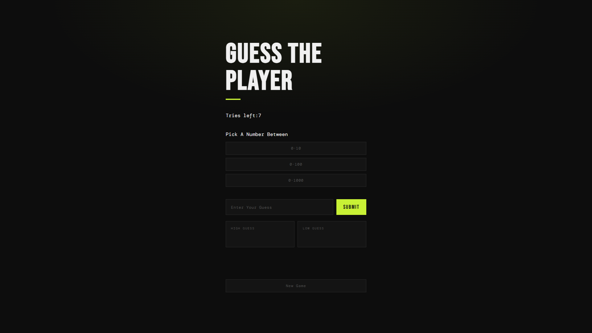

# 🎯 Guess The Number

A fun and interactive number guessing game built with HTML, CSS, and vanilla JavaScript.

---

## 🕹️ How To Play

1. Pick a difficulty level
2. Enter your guess in the input field
3. Hit **Submit** or press **Enter**
4. Use the High/Low hints to narrow down the number
5. Guess the correct number before your 7 tries run out!

---

## ✨ Features

- **3 Difficulty Levels**
  - Easy — 0 to 10
  - Medium — 0 to 100
  - Hard — 0 to 1000

- **7 Tries** — You only get 7 chances. Use them wisely!

- **High / Low Tracker** — Every wrong guess gets logged. Too high goes in the High box, too low goes in the Low box

- **Wrong Guess Sound** — A sound plays every time you guess wrong

- **Active Difficulty Glow** — The selected difficulty button glows so you always know which mode you're in

- **Win / Game Over Message** — You Won 🏆 if you guess right, Game Over 💀 if you run out of tries. Game Over turns red!

- **Enter Key Support** — No need to click Submit, just hit Enter

- **Numbers Only Input** — Letters and special characters are blocked automatically

- **New Game Button** — Resets everything — score, guesses, tries, and secret number — so you can start fresh

---

## 🛠️ Built With

- HTML
- CSS
- Vanilla JavaScript

---

## 📁 File Structure

```
├── index.html
├── index.css
├── indexx.js
└── README.md
```

---

## 📸 Screenshot



## 🚀 How To Run

Just open `index.html` in your browser — no installation needed!
